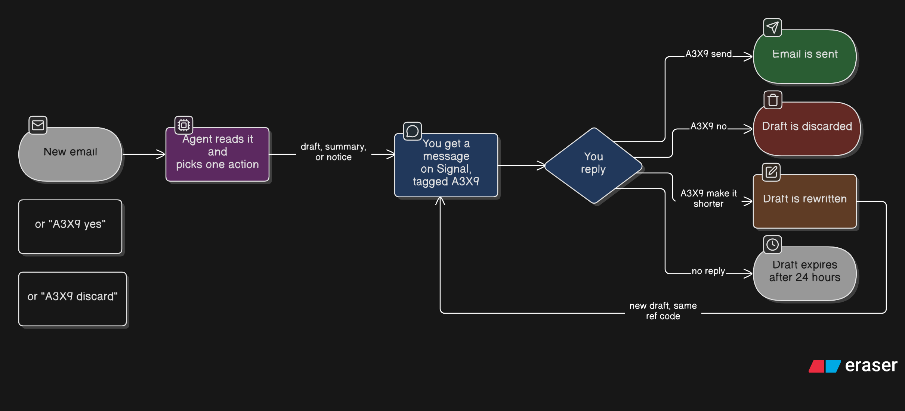
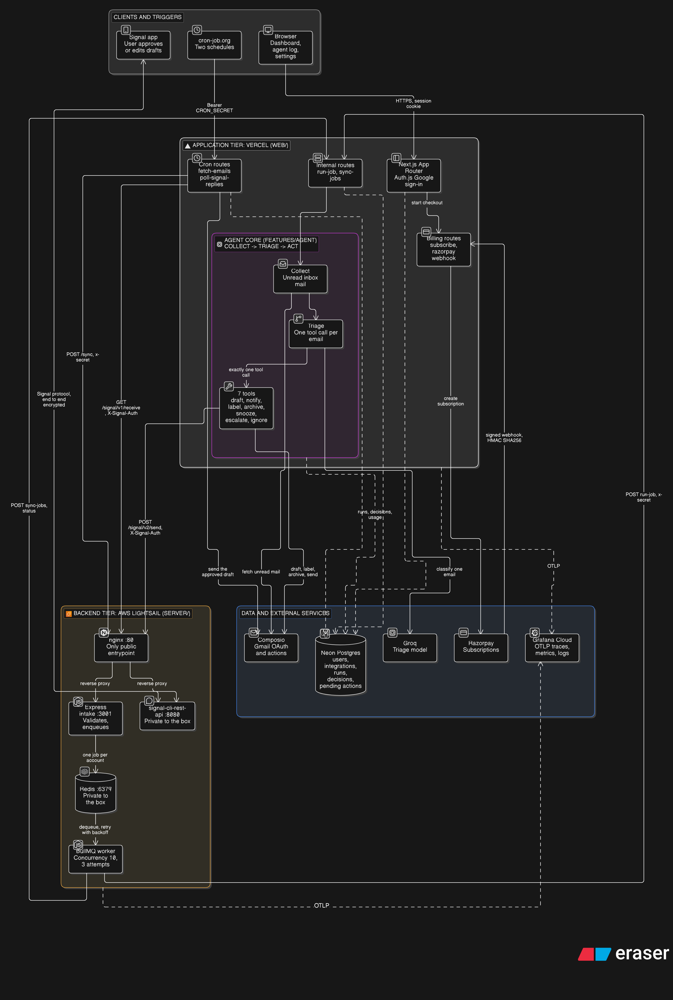
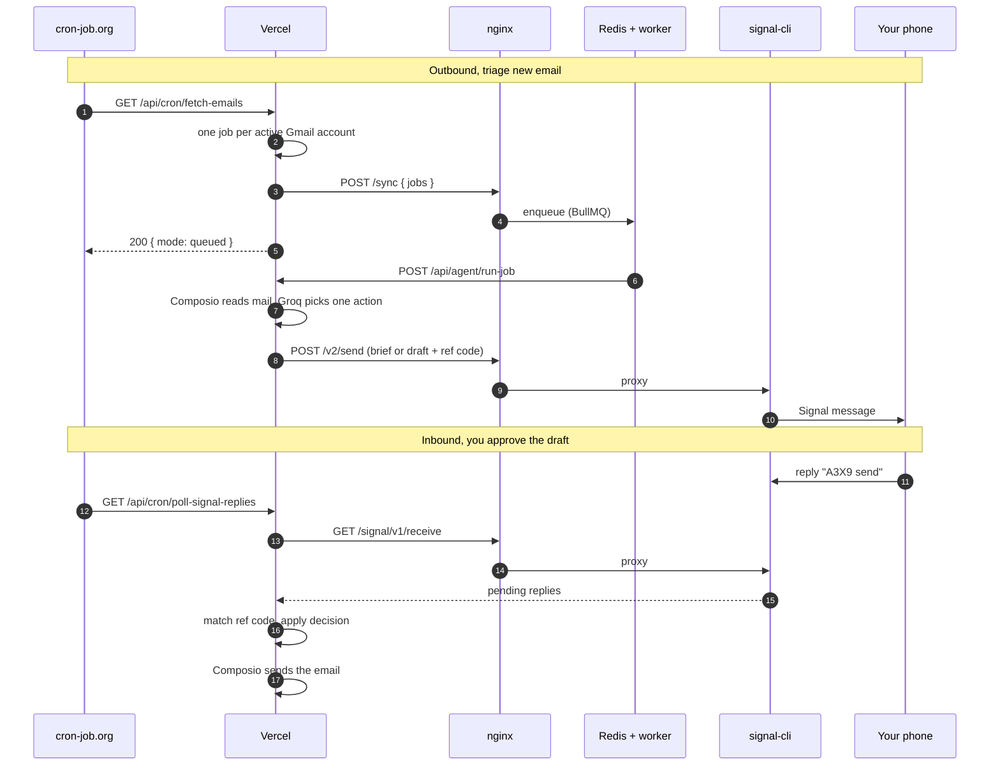
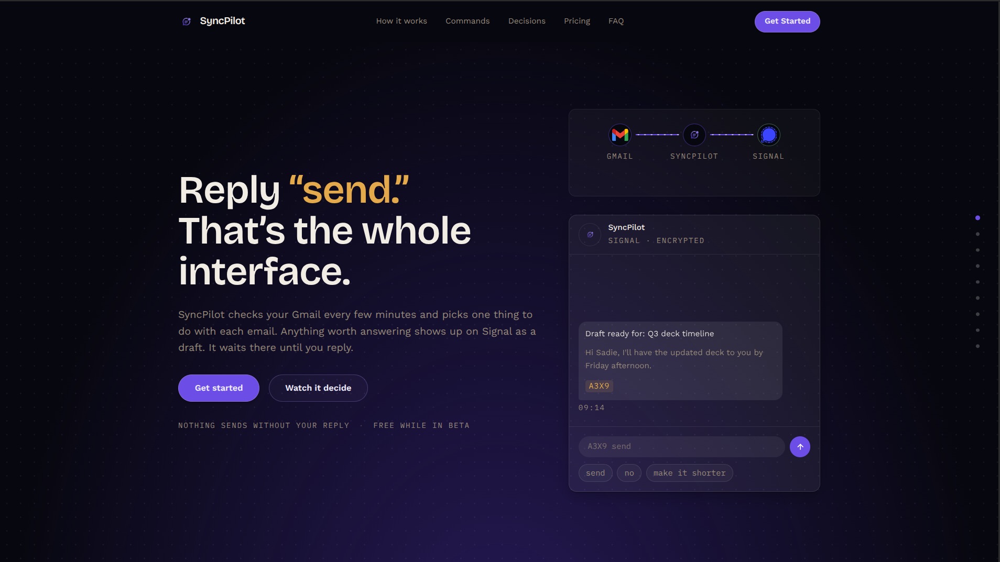
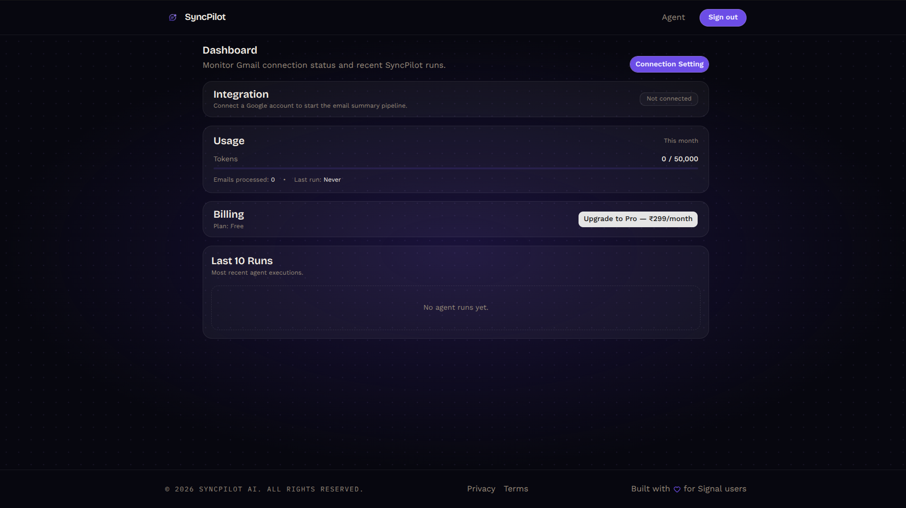
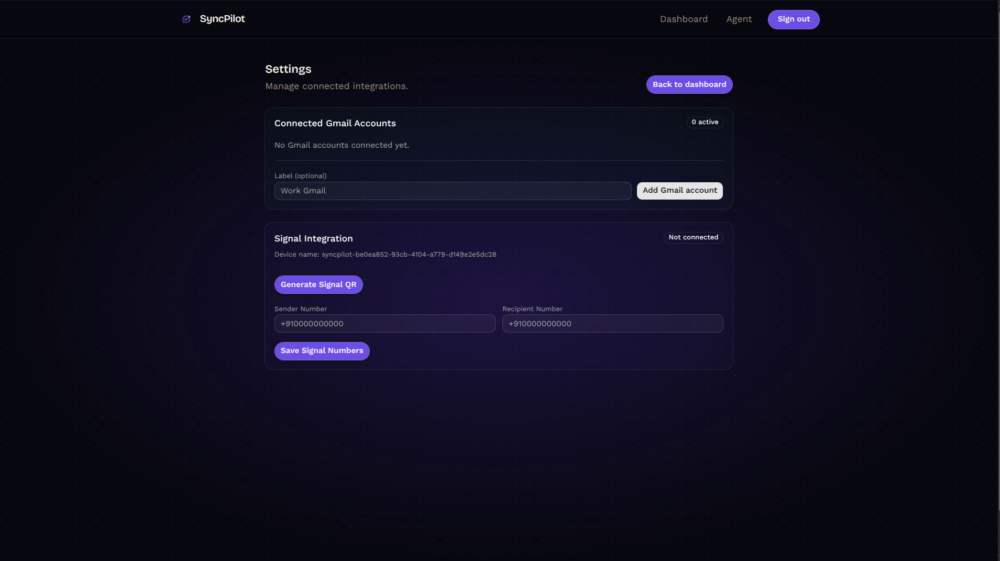
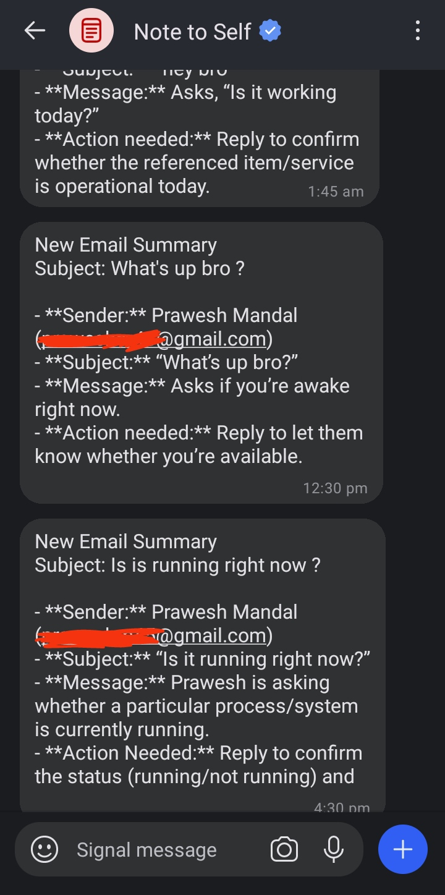

<div align="center">

# SyncPilot Agent

**SyncPilot reads your Gmail, decides what each email needs, and messages you on Signal.**

**It never sends an email without your approval.**

</div>

<div align="center">
  
</div>

Every few minutes it checks for new mail. Each message gets exactly one action:
summarize, archive, label, escalate, snooze, or draft a reply.

Only drafts need you. They arrive with a 4 character ref code, and nothing is
sent until you answer.

---

---

## Table of Contents

- [Features](#features)
- [Architecture](#architecture)
  - [How the services talk](#how-the-services-talk)
  - [The two flows](#the-two-flows)
- [Screenshots](#screenshots)
- [Tech stack](#tech-stack)
- [What problem it solves](#the-problem)
- [Project structure](#project-structure)
- [Getting started](#getting-started)
- [Environment variables](#environment-variables)
- [Full documentation](#full-documentation)
- [API documentation](#api-documentation)
- [Testing](#testing)
- [Production deployment](#production-deployment)
- [Design decisions](#design-decisions)
  - [Scalability](#scalability)
  - [Reliability](#reliability)
  - [Security](#security)
  - [Performance and usability](#performance-and-usability)
- [Limitations](#limitations)
- [Future improvements](#future-improvements)
- [License](#license)

---

## Features

| Feature | Detail |
| --- | --- |
| **One decision per email** | The model must call exactly one tool per message. The tool call *is* the decision, so there is no free text to parse into an action. |
| **Human approval for sends** | Drafts go out with a 4 character ref code and wait. Nothing is sent without a reply. |
| **Reply from Signal** | `send`, `no`, or any other text, which is treated as rewrite instructions. |
| **Multiple Gmail accounts** | Per user, processed concurrently. |
| **Two execution modes** | Inline for local and single account use, or a queued worker pool for scale. One environment variable switches between them. |
| **Durable job history** | Queue state is mirrored into Postgres, so it survives Redis eviction. |
| **No Gmail tokens stored** | Composio holds the OAuth connection. |

---

## Architecture

Two deployed pieces plus managed services:

| Piece | Runs on | Responsibility |
| --- | --- | --- |
| **`web/`** | Vercel | UI, auth, and all agent logic (Gmail via Composio, triage via Groq, Signal send and receive) |
| **`server/`** | AWS Lightsail (VPS)| Express intake API, BullMQ worker, Redis, self hosted signal-cli |

### How the services talk

<div align="center">
  
</div>

### The two flows


```mermaid
sequenceDiagram
    autonumber
    participant S as cron-job.org
    participant V as Vercel
    participant N as nginx
    participant Q as Redis + worker
    participant G as signal-cli
    participant P as Your phone

    note over S,P: Outbound, triage new email
    S->>V: GET /api/cron/fetch-emails
    V->>V: one job per active Gmail account
    V->>N: POST /sync { jobs }
    N->>Q: enqueue (BullMQ)
    V-->>S: 200 { mode: queued }
    Q->>V: POST /api/agent/run-job
    V->>V: Composio reads mail, Groq picks one action
    V->>N: POST /v2/send (brief or draft + ref code)
    N->>G: proxy
    G->>P: Signal message

    note over S,P: Inbound, you approve the draft
    P->>G: reply "A3X9 send"
    S->>V: GET /api/cron/poll-signal-replies
    V->>N: GET /signal/v1/receive
    N->>G: proxy
    G-->>V: pending replies
    V->>V: match ref code, apply decision
    V->>V: Composio sends the email
```

---

## Screenshots

<table>
<tr>
<td width="50%"><br/><sub><b>Landing page</b></sub></td>
<td width="50%"><br/><sub><b>Dashboard with recent runs</b></sub></td>
</tr>
<tr>
<td width="50%"><br/><sub><b>Connecting Gmail and Signal</b></sub></td>
<td width="50%"><br/><sub><b>Brief and draft on Signal</b></sub></td>
</tr>
</table>

---

## Tech stack

| Layer | Stack | Why |
| :-- | :-- | :-- |
| Web |  Next.js 16 &nbsp;+  React 19 | App Router, route handlers double as the API |
| Language |  TypeScript 5 | Strict mode, `tsc --noEmit` gates every push |
| Styling |  Tailwind CSS 4 | With shadcn and Radix primitives |
| Auth |  Auth.js v5 | Google sign in, JWT sessions |
| Database |  Neon Postgres &nbsp;  Drizzle | Typed schema, generated migrations, HTTP driver |
| Gmail |  Composio | Holds the OAuth connection so this app never stores Gmail tokens |
| Model |  Groq via  Vercel AI SDK | `openai/gpt-oss-120b`, tool calling |
| Queue |  BullMQ + Redis | Retries, backoff, concurrency, inspectable state |
| Intake |  Express 5 | Small enough that the whole server is ~520 lines |
| Signal |  signal-cli-rest-api | Self hosted, native mode |
| Proxy |  nginx | The only public door into the box, enforces the Signal auth header |
| Containers |  Docker Compose | Three containers in production, two for local development |
| Billing |  Razorpay | Subscriptions with signed, idempotent webhooks |
| Observability |  OpenTelemetry + &nbsp;  Grafana Cloud | Structured JSON logs, traces and metrics over OTLP |
| Tests |  Vitest | 275 tests across 32 files |
| CI/CD |  GitHub Actions + GHCR | Build the image in CI, the server only pulls |
| Hosting |  Vercel &nbsp; +  AWS Lightsail (VPS) | Serverless for the app, one $7/month box for the queue and Signal |

---

## What problem it solves

Inbox automation usually forces a bad choice:

- Read everything yourself, or
- Let a tool act on your account and hope it does not send something embarrassing.

**SyncPilot splits the work.**

| Who | Does what |
| --- | --- |
| The model | Reads every message and decides what it needs |
| You | Approve anything irreversible, which in practice means sending mail |

The approval step lives in Signal instead of another dashboard, because a
dashboard is one more thing to remember to open.

---

## Project structure

```
web/                    Next.js app, deployed to Vercel
  app/api/              Route handlers (the API surface)
  features/
    agent/              Triage loop, tools, result parsing
    agent/tools/        One file per decision the model can make
    ai/                 Groq client, summarise, rewrite
    gmail/              Gmail actions, parsing, labels
    signal/             Send, receive, reply parsing, routing
  db/                   Drizzle schema and queries
  lib/                  Encryption, retry, timing safe compare
  config/               Env validation, plan limits

server/                 Deployed to Lightsail
  server.ts             Express intake API
  worker.ts             BullMQ consumer
  queue.ts              Queue setup and job options
  agent.ts              Calls back into the web app

tests/
  web_test/             Mirrors web/
  server_test/          Mirrors server/

docs/
  local_run.md                    Run it on your machine
  api_docs.md                     Every endpoint
  testing_docs.md                 Test suite and CI
  prod_deploy_aws_lightsail.md    Production deployment
  observability.md                Telemetry to Grafana Cloud

run.sh                  Runs web, intake server, and worker together
docker-compose.yml      Redis and signal-cli for local development
```

---

## Getting started

Full walkthrough: **[docs/local_run.md](docs/local_run.md)**

```bash
git clone https://github.com/your-username/your-repo.git syncpilot
cd syncpilot
pnpm install --dir web
pnpm install --dir server

docker compose up -d          # Redis and signal-cli

cp web/.env.example web/.env.local
cp server/.env.example server/.env.local
# fill both in, then:
cd web && pnpm db:migrate && cd ..

./run.sh                      # web + intake server + worker
```

**Three things to know:**

- `docker-compose.yml` deliberately runs only the supporting services. The web
  app, intake server, and worker run on the host so you keep hot reload.
- `./run.sh` reads `.env.local`. `./run.sh production` reads `.env.production`
  and builds the web app first.
- **Postgres is not in the compose file.** `web/db/client.ts` uses the Neon HTTP
  driver, which speaks HTTP to a Neon endpoint rather than opening a TCP
  connection, so a plain Postgres container cannot serve it. Use a free Neon
  database.

---

## Environment variables

Every variable is documented inline in the example files:

- **[`web/.env.example`](web/.env.example)** for the Next.js app
- **[`server/.env.example`](server/.env.example)** for the intake server and worker

Copy them to `web/.env.local` and `server/.env.local`.

---

## Full documentation

| Doc | Covers |
| :-- | :-- |
| **[docs/local_run.md](docs/local_run.md)** | Running the whole stack on your machine, with a verification step after each stage |
| **[docs/api_docs.md](docs/api_docs.md)** | Every endpoint: auth scheme, request body, response body, status codes |
| **[docs/testing_docs.md](docs/testing_docs.md)** | Test layout, the vitest config that makes it work, and the three CI jobs |
| **[docs/prod_deploy_aws_lightsail.md](docs/prod_deploy_aws_lightsail.md)** | Full production deployment, from creating the instance to proving it works |
| **[docs/observability.md](docs/observability.md)** | Wiring traces, metrics, and logs to Grafana Cloud over OTLP |

---

## API documentation

**[docs/api_docs.md](docs/api_docs.md)** covers every endpoint: auth scheme,
request shape, response shape, and status codes.

| Route | Caller | Auth |
| --- | --- | --- |
| `/api/cron/fetch-emails` | Scheduler | `Bearer CRON_SECRET` |
| `/api/cron/poll-signal-replies` | Scheduler | `Bearer CRON_SECRET` |
| `/api/agent/run-job` | Queue worker | `x-secret` |
| `/api/internal/sync-jobs` | Queue worker | `x-secret` |
| `/api/webhooks/razorpay` | Razorpay | HMAC signature |
| `/api/signal/qr`, `/api/agent/run`, `/api/billing/subscribe` | Browser | Session |
| `POST /sync` | Vercel | `x-secret` |
| `GET /health` | Anyone | none |
| `/admin/queues` | You | Basic auth |

Four callers, four auth schemes, no shared middleware. Each route checks its own.

---

## Testing

**[docs/testing_docs.md](docs/testing_docs.md)**

```bash
cd web && pnpm test        # 224 tests, 24 files
cd server && pnpm test     # 51 tests, 8 files
```

| | Count |
| --- | --- |
| Total tests | **275** |
| Test files | 32 |
| Runtime | Under 3 seconds |
| Type | All unit tests, externals mocked at the module boundary |

CI runs typecheck, tests, and lint on every push and pull request.

---

## Production deployment

**[docs/prod_deploy_aws_lightsail.md](docs/prod_deploy_aws_lightsail.md)**

A full walkthrough for deploying `server/` to AWS Lightsail, including the
GitHub Actions pipeline, with a verification step and expected output after
every stage.

**How a deploy runs** (`.github/workflows/deploy-server.yml`):

1. Push to `main` touching `server/`
2. GitHub runs typecheck and tests
3. GitHub builds the Docker image and pushes it to GHCR
4. GitHub connects over SSH, pulls the image, restarts the containers
5. The workflow polls `/health` and pings Redis before it reports success

---

## Design decisions

The parts that took the most thought, grouped by what they protect.

### Scalability

<details open>
<summary><b>Two execution modes behind one variable</b></summary>

<br/>

| `INTAKE_SERVER_URL` | Behaviour |
| --- | --- |
| blank | `fetch-emails` runs every account inline in the request |
| set | The same route fans out to the queue and returns immediately |

Local development needs no Redis and no worker. Production gets a worker pool.
One code path.

</details>

<details>
<summary><b>The worker calls back instead of running the agent</b></summary>

<br/>

`server/worker.ts` is 83 lines and its job handler is a single `fetch` to
`/api/agent/run-job`.

- Agent logic stays in one package, so the Gmail and Groq code cannot drift into
  two copies.
- The always on box needs almost no CPU. It idles under 1%.
- That is what let it move from a **$77/month EC2 instance to a $7/month
  Lightsail bundle.**

</details>

### Reliability

<details>
<summary><b>Retries are off by default</b></summary>

<br/>

`web/lib/retry.ts` bounds how long we wait, but a timeout cannot cancel a call
that already reached the server.

So `executeGmailTool` passes `retries: options.retries ?? 0`. Every Gmail action
gets one attempt unless a caller explicitly asks for more, and a timed out but
applied send is never repeated by accident.

</details>

<details>
<summary><b>Failed and dead are different states</b></summary>

<br/>

BullMQ fires its `failed` event on every attempt. The worker checks
`attemptsMade` against the configured limit and only reports `dead` once the job
is genuinely out of retries, so a transient error does not look permanent in the
UI.

</details>

<details>
<summary><b>Job history is written to Postgres</b></summary>

<br/>

Redis keeps only the last 100 completed and 500 failed jobs. Queue state is the
source of truth while a job runs, but history goes to `sync_jobs` via
`/api/internal/sync-jobs` so it does not vanish on eviction.

</details>

<details>
<summary><b>Emails are claimed atomically, not checked then written</b></summary>

<br/>

`claimEmailForProcessing` is one `INSERT ... ON CONFLICT DO UPDATE` with
`setWhere` limited to claimable statuses, returning the row.

- If two runs race on the same message, exactly one gets a row back and proceeds.
- Emails already `notified`, `drafted`, or `archived` are never reclaimed.
- A read then write would leave a window where both runs think they won.

</details>

<details>
<summary><b>Idempotency where replays are expected</b></summary>

<br/>

- `processed_webhook_events` keyed on `x-razorpay-event-id` stops a retried
  payment webhook applying twice. Payment providers retry by design.
- `markEmailHandledIfAbsent` is the matching backstop for a tool that failed
  after acting but before recording it.

</details>

<details>
<summary><b>Signal polling is narrowed on purpose</b></summary>

<br/>

Only users with a pending draft are polled, and duplicate Signal numbers are
removed first. Polling everyone caused lock contention inside signal-cli.

</details>

### Security

<details>
<summary><b>Timing safe secret comparison</b></summary>

<br/>

All four auth paths use `secureEquals` instead of `===`. A missing or
unconfigured secret is treated as unauthorized rather than throwing, so a half
configured deploy returns 401 instead of 500.

</details>

<details>
<summary><b>The queue dashboard cannot leak</b></summary>

<br/>

`/admin/queues` is only mounted when **both** `QUEUE_DASHBOARD_USER` and
`QUEUE_DASHBOARD_PASSWORD` are set. If either is missing the route does not
exist, so it cannot be exposed unauthenticated by accident.

</details>

### Performance and usability

<details>
<summary><b>Neon's HTTP driver, not a pooled TCP client</b></summary>

<br/>

Each query is one HTTP request. There are no long lived sockets to go stale
between serverless invocations and no cold connect timeout when the database
wakes from idle.

</details>

<details>
<summary><b>Ref codes avoid ambiguous characters</b></summary>

<br/>

The alphabet is `ABCDEFGHJKMNPQRSTUVWXYZ23456789`. No `I`, `L`, `O`, `0`, or
`1`, because people retype these codes off a phone screen.

</details>

---

## Limitations

Stated plainly.

| Limitation | Detail |
| --- | --- |
| **Not load tested** | No benchmarks exist. The worker is configured for concurrency 10, but that number has not been validated under real load. |
| **No integration or e2e tests** | Nothing runs against a real Postgres, Redis, or signal-cli, and there are no component tests for the UI. |
| **Plain HTTP to the box** | No domain, so no TLS. Secrets and email content cross the network unencrypted. Needs a domain and Certbot before real users. |
| **`/health` does not check Redis** | It returns ok with the queue completely down. Real verification means reading the nginx access log and the Redis job counts. |
| **Token limits not enforced** | `FREE_MONTHLY_TOKEN_LIMIT` exists in `web/config/plans.ts` and is used by the UI, but nothing blocks a run that exceeds it. |
| **Single points of failure** | One box runs Redis, the worker, and signal-cli. Redis is not replicated. The `signal-cli-config` volume is the one piece of state not in git or Postgres. |
| **Ref code required** | Signal replies must start with a ref code. Free form commands are not implemented. |
| **Gmail only** | No Outlook or IMAP. |
| **Manual migrations** | No auto migrate on deploy, in any environment. |

---

## Future improvements

- **TLS** with a domain and Certbot, which also removes the plain HTTP
  limitation above.
- **A real health check** that pings Redis and returns 503 when it cannot, so a
  broken queue fails the deploy instead of passing it.
- **Enforce `FREE_MONTHLY_TOKEN_LIMIT`** at run time.
- **Integration tests** against real Redis and Postgres containers.
- **Free form Signal commands** that apply across all connected Gmail accounts.
- **Horizontal worker scaling** with managed Redis, which would remove the
  single box failure mode.
- **Additional mail providers.**

---

## License

See [LICENSE](LICENSE).
